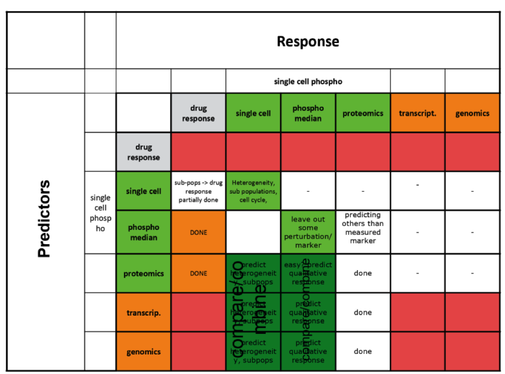

```{r setup, include=FALSE}
knitr::opts_chunk$set(echo = TRUE)
library(tidyverse)
```


## Overview



## What data do we provide?


### Median data
```{r, echo=FALSE}
library(pheatmap)
phospho_median <- readRDS("./data/raw_data/Median_allsamples_nocontrols_withcellcount.rds") %>% as_tibble()
reporters = c('IdU', 'p-CREB', 'p-STAT5', 'p-SRC', 'p-FAK', 'p-MEK', 'p-MAPKAPK2',
			  'p-S6K', 'p-MAP2K3', 'p-STAT1', 'p-p53', 'p-NFkB', 'p-p38', 'p-AMPK',
			  'p-Akt(Ser473)', 'p-ERK', 'CyclinB', 'p-GSK3b', 'GAPDH', 'p-MKK3-MKK6',
			  'p-PDPK1', 'p-BTK', 'p-p90RSK', 'p-SMAD23', 'p-STAT3', 'p-JNK',
			  'Ki-67', 'p-H3', 'p-S6', 'cleavedCas', 'p-MKK4', 'p-AKT(Thr308)',
			  'p-RB', 'p-4EBP1')
phospho_median <-phospho_median %>% rename(cellcount=`dmt$cellcount`)
phospho_median <-phospho_median %>% gather(key = "reporter",value="value",reporters) 
phospho_median <- phospho_median %>% 	mutate(time=ifelse(is.na(time),0,as.numeric(as.character(time))))
phospho_median
str(phospho_median)
```

```{r}
# check if there is any duplication: 
duplicated_A <- phospho_median %>% 
	filter(time_course == "A") %>%
	group_by(cell_line, treatment, time, reporter) %>% filter(n()>1) %>% arrange(cell_line,treatment,time,reporter)

duplicated_B <- phospho_median %>% 
	filter(time_course == "B") %>%
	group_by(cell_line, treatment, time, reporter) %>% filter(n()>1) %>% arrange(cell_line,treatment,time,reporter)

unique(duplicated_A$cell_line)
unique(duplicated_B$cell_line)

# Righjt now I am averaging duplicated measurements:
phospho_median_overview <-  phospho_median %>% 
	group_by(cell_line,time_course, treatment, time, reporter) %>% 
 	summarise(value = mean(value,na.rm = T) ) %>% ungroup() %>%
	# Iam also aggregating timecourses and TIMES!!!! (we either provide all timecourse or none)
 	group_by(cell_line, treatment, reporter) %>% 
 	summarise(value = mean(value,na.rm = T) ) %>% ungroup()
```


```{r}
# let's work on a heatmap
wide_phospho <- phospho_median_overview %>% mutate(id = paste(reporter,treatment,sep = "_")) %>%
	select(cell_line,id,value) %>%
	spread(id,value)

heatmap_x_label <- wide_phospho %>% column_to_rownames("cell_line") %>%
	colnames() %>% ifelse(grepl("iMEK",.),.,"") %>%
	gsub("_iMEK","",.)

heatmap_x_annotation <- wide_phospho %>% column_to_rownames("cell_line") %>%
	colnames() %>% gsub("[a-zA-Z0-9\\(\\)-]+_","",.) %>% data.frame(treatment=.)

rownames(heatmap_x_annotation)<- wide_phospho %>% column_to_rownames("cell_line") %>%
	colnames()

hm_data = wide_phospho %>% 
	column_to_rownames("cell_line") %>%
	as.matrix()%>%
	pheatmap::pheatmap(cluster_rows = F,
					   cluster_cols = F,
					   color= colorRampPalette(c("white","firebrick"))(100),
					   labels_col = heatmap_x_label, 
					   annotation_col = heatmap_x_annotation)

```

TODO: 

Show on this map what is the trainig, what is kept etc

# Show Interesting features to support challenge questions

### p-ERK plateau vs peak in response to EGF
on absolute scale
```{r, fig.height=7, fig.width=7}
phospho_median %>% 
	filter(treatment=="EGF") %>%
	filter(reporter=="p-ERK") %>%
	ggplot(aes(time,value)) + geom_line() + facet_wrap(~cell_line) + theme_bw()
```

```{r,fig.height=7, fig.width=7}
# scaled to time 0 
phospho_median %>% 
	filter(treatment=="EGF") %>%
	filter(reporter=="p-ERK") %>%
	group_by(cell_line,time_course) %>%
	mutate(rel_value = value - mean(value[time==0])) %>%
	ggplot(aes(time,rel_value)) + geom_line() + 
	facet_wrap(~cell_line) +
	ggtitle("p-ERK in response to EGF") +
	ylab("p-ERK - p-ERK(@T=0)") + theme_bw()


```
TODO: select cell-lines with nice plateau and peaks

### MEK-independent p-ERK signaling

```{r,fig.height=7, fig.width=10}
# scaled to time 0 
phospho_median %>% 
	filter(treatment %in% c("EGF","iMEK")) %>%
	filter(reporter %in% c("p-ERK")) %>%  # ,"p-p90RSK"
	#group_by(cell_line,time_course,reporter) %>%
	#mutate(rel_value = value - mean(value[time==0],na.rm = T)) %>%
	#ungroup() %>%
	ggplot(aes(time,value)) + geom_line(aes(col=treatment)) + 
	facet_wrap(~cell_line) +
	ggtitle("p-ERK in response to EGF and iMEK") +  # , p-90RSK
	ylab("p-ERK12") + theme_light()


```

### EGFR dependent MEK stimulation
show that some signaling is not related to EGFR, the SIGNALING is due to serum:
in this cases iEGFR does not influcen the signaling of MEK/ERK ? (other nodes?)

```{r,fig.height=7, fig.width=10}

phospho_median %>% 
	filter(treatment %in% c("EGF","iEGFR")) %>%
	filter(reporter %in% c("p-ERK")) %>%  # ,"p-p90RSK"
	ggplot(aes(time,value)) + geom_line(aes(col=treatment,linetype=reporter)) + 
	facet_wrap(~cell_line) +
	ggtitle("p-ERK in response to EGF and iEGFR") +  # , p-90RSK
	ylab("p-ERK12") + theme_light()
```

Calculate the difference for each marker:
```{r,fig.height=7, fig.width=10}

top_EGFR_dependent <- phospho_median %>% 
	filter(treatment %in% c("EGF","iEGFR")) %>%  # check difference between EGF and iEGFR
	#filter(reporter %in% c("p-ERK","p-p90RSK")) %>%  # ,
	group_by(cell_line,time, time_course, reporter) %>%  # find points where we have both treatment at the time 
	filter(length(unique(treatment))==2) %>%
	mutate(diff_value = mean(value[treatment=="EGF"]) - mean(value[treatment=="iEGFR"])) %>%  # calculate difference
	ungroup() %>%
	group_by(cell_line, reporter) %>% 
	summarise(rmse = sqrt(sum(diff_value^2)/length(diff_value))) %>%  # calc RMSE over time
	arrange(rmse) %>% group_by( reporter) %>% top_n(rmse, n=5)  # select top 5 for each reporter across all cell lines

bottom_EGFR_dependent <- phospho_median %>% 
	filter(treatment %in% c("EGF","iEGFR")) %>%  # check difference between EGF and iEGFR
	#filter(reporter %in% c("p-ERK","p-p90RSK")) %>%  # ,
	group_by(cell_line,time, time_course, reporter) %>%  # find points where we have both treatment at the time 
	filter(length(unique(treatment))==2) %>%
	mutate(diff_value = mean(value[treatment=="EGF"]) - mean(value[treatment=="iEGFR"])) %>%  # calculate difference
	ungroup() %>%
	group_by(cell_line, reporter) %>% 
	summarise(rmse = sqrt(sum(diff_value^2)/length(diff_value))) %>%  # calc RMSE over time
	arrange(rmse) %>% group_by( reporter) %>% top_n(rmse, n=-5)  # select top 5 for each reporter across all cell lines


```


### EGF dependent AKT signaling profile (peak vs plateau)

```{r,fig.height=7, fig.width=10}
phospho_median %>% 
	filter(treatment %in% c("EGF")) %>%
	filter(reporter %in% c("p-Akt(Ser473)")) %>%  # ,"p-p90RSK"
	ggplot(aes(time,value)) + geom_line() + 
	facet_wrap(~cell_line) +
	ggtitle("p-Akt(Ser473) in response to EGF") +  # , p-90RSK
	ylab("p-Akt(Ser473)") + theme_light()
```

### PI3K dependent AKT signaling
```{r,fig.height=7, fig.width=10}
phospho_median %>% 
	filter(treatment %in% c("EGF","iPI3K")) %>%
	filter(reporter %in% c("p-Akt(Ser473)")) %>%  # ,"p-p90RSK"
	ggplot(aes(time,value)) + geom_line(aes(col=treatment,linetype=reporter)) + 
	facet_wrap(~cell_line) +
	ggtitle("p-Akt(Ser473) in response to EGF and iPI3K") +  # , p-90RSK
	ylab("p-Akt(Ser473)") + theme_light()
```
### EGFR dependent AKT signaling
```{r,fig.height=7, fig.width=10}
phospho_median %>% 
	filter(treatment %in% c("EGF","iEGFR")) %>%
	filter(reporter %in% c("p-Akt(Ser473)")) %>%  # ,"p-p90RSK"
	ggplot(aes(time,value)) + geom_line(aes(col=treatment,linetype=reporter)) + 
	facet_wrap(~cell_line) +
	ggtitle("p-Akt(Ser473) in response to EGF and iEGFR") +  # , p-90RSK
	ylab("p-Akt(Ser473)") + theme_light()
```


### S6 dynamics in response to EGF
```{r,fig.height=7, fig.width=10}
phospho_median %>% 
	filter(treatment %in% c("EGF")) %>%
	filter(reporter %in% c("p-S6")) %>%  # ,"p-p90RSK"
	ggplot(aes(time,value)) + geom_line() + 
	facet_wrap(~cell_line) +
	ggtitle("p-S6 in response to EGF ") +  # , p-90RSK
	ylab("p-S6") + theme_light()
```